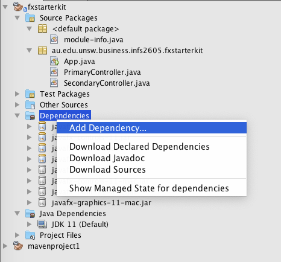
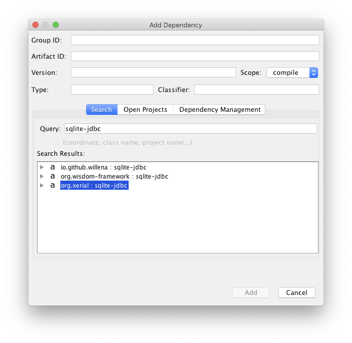
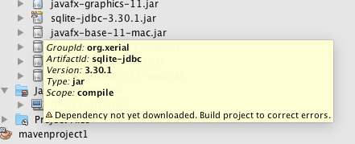
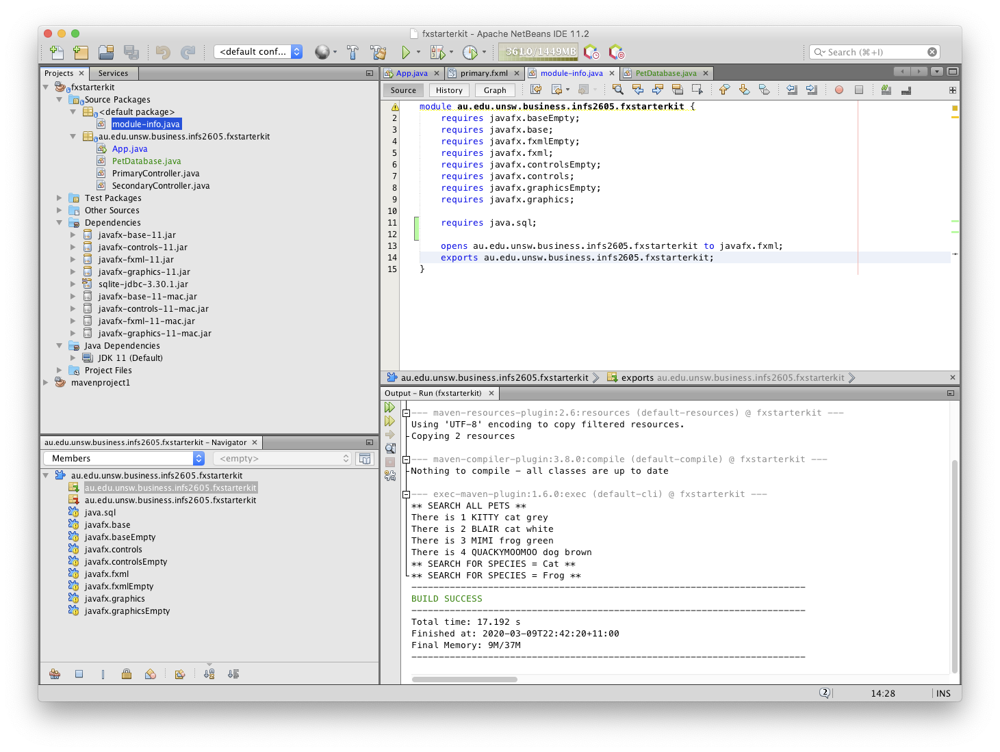

# How to add external libraries to your NetBeans 11 JavaFX project

## 1. What do you mean by 'external libraries'?

The Java development platform (specifically, in our case, OpenJDK 11with OpenJFX) provides most of the foundational code that you need in order to make a basic program.

However, sometimes you want to do more than just basic things. For example, as you experimented with on Ed in your tutorials, you may want to work with a SQLite database. Another example is that you might want to be able to write to PDF files. As you saw with the SQLite database example, the easiest way to do something like this is usually to make use of code that other people have written. This is a "library" (imagine going into a physical library full of books, and learning lots of new knowledge).

In Java, libraries are usually packaged as JAR files. Once upon a time, the best way to add a library packaged as a JAR file into your project would be to manually download the JAR file and manually configure your project to use that JAR file. That is the case with commandline-based development environments, which is how Ed works. When you click the green "play" button on Ed, it executes build and run commands:

```bash
javac -cp ".:./sqlite-jdbc-3.30.1.jar" PetDatabase.java  
java -cp ".:./sqlite-jdbc-3.30.1.jar" PetDatabase
```

This command works by looking for the `sqlite-jdbc-3.30.1.jar` file that you have to manually download and then set up. If you speak to some students who have completed INFS2605 in the past, they will tell you how awful it is for the JAR files to go missing, or configured incorrectly due to absolute paths instead of relative paths, etc. I've seen groups lose marks because of silly things like that.

However, in NetBeans 11 using Maven, we now have a better way.

## 2. Maven? What Maven?

An integrated development environment (IDE) like NetBeans can just do the commandline-based way of building and running Java projects, but
in modern IDEs include build systems. For example, if you are familiar with NetBeans 8, that used a build system called Ant. In NetBeans 11,
there are now two other build systems that we can use: Gradle and Maven.

Build systems exist independently of IDEs; for example, if you will be taking INFS3634 (Mobile App Development), I believe they use Android Studio with
Gradle. In INFS2605, I have set up this JavaFX starter kit to use Maven.
The job that Maven performs is to make the sample program aware of the JavaFX jmods so that you can bypass the complicated setup required
to make the "New JavaFX Application" dialog work.

Maven handles external libraries (JARs) using a "package manager" design similar to Chocolatey (Windows) or Homebrew (Mac).
The idea is that instead of you having to download the installer files yourself and fiddling with the setup, the package manager connects to a central
database called a repository. All you have to do is give the package manager the exact instructions about what items you'd like, and the package manager
will go fetch them for you :)

## 3. Great! So how do I get Maven to download libraries for me...?

**Step 1.** First, go to the _Dependencies &rarr; Add Dependency ..._ menu item:



**Step 2.** Now if you search for, for example, _sqlite-jdbc_, you see we get some options:



**Step 3.** I'm going to go with the xerial option because I know that works. If you select on the latest version, you can add it. 


**Step 4.** Clicking <kbd>Add</kbd> will add this to the project. You will, at first, encounter a warning note:



This will clear up next time you clean and build the project.

**Step 5.** Go to the `modules-info.java` file. It's not in the same package as the rest of the project (this is intentional).
Make sure you add some new `requires` statements. For JDBC-related libraries, JDBC will handle the actual loading of the driver as long as
you have `requires java.sql;` (which makes your project JDBC-friendly). But, for other libraries, you'll need to know the package name.
For example, when I used Apache PDFBox, I had to have `requires org.apache.pdfbox;` - this is the package name for Apache PDFBox.

... _et voilà_:




To keep things simple, I would recommend you stick with libraries available through the Maven repository (i.e., those that
appear in the search results in Step 3). While it can be tempting to go searching through the Internet for fancy libraries that look good in a demo,
this can quickly lead to dependency hell as I've personally experienced on unfortunately unsuccessful projects brought to their knees by libraries
causing conflicts with each other and with what we needed to do with the project ... 

In any case, I'm confident that the Maven repository has everything you would need to finish any task with a HD grade ;)
